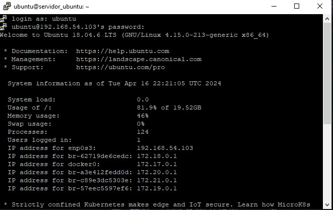
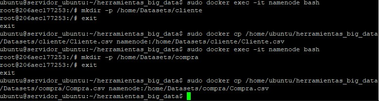
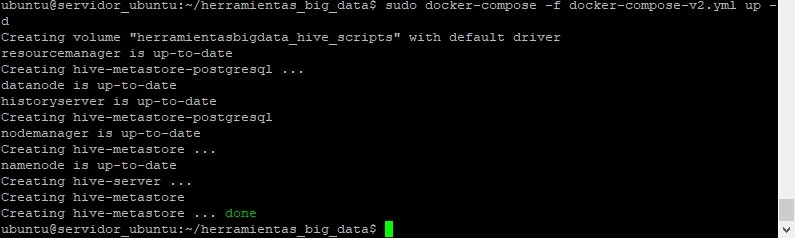
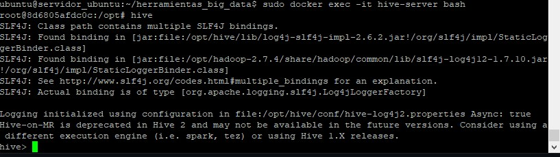
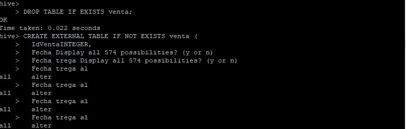
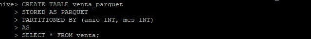

# Herramientas-para-Big-Data

Mediante esta guía vamos a emular un ambiente de trabajo para poder implementar Big Data. Vamos a utilizar herramientas como Putty,Hadoop,Hive,etc.

Previamente tiene que tener instalado una máquina virtual (te recomiendo que uses VirtualBox pero puede ser cualquier máquina virtual de su agrado) y otros programas para facilitarle el aprendizaje.

# Instalación de Putty

Putty es un emulador de terminal que los usuarios de Windows pueden usar para conectarse a un sitio web. Ahora le vamos a explicar como utilizarlo para que usted pueda manejar la consola de Linux desde Windows.

En la terminal de Linux usted va a poner el comando que le paso aquí abajo para que usted pueda ver su dirección IP.
```
hostname -I
```
A usted le va a aparecer esto. Eso quiere decir que usted ya puede utilizar la terminal de Linux desde Windows con toda comodidad.



Una vez instalado Putty vamos a proceder a seguir con la guía.

Lo que vamos a hacer ahora es clonar nuestro repositorio e inicializar nuestro docker-compose
```
https://github.com/LautaroVergaraAmodeo97/Herramientas-para-Big-Data.git
cd herramientas_big_data
sudo docker-compose -f docker-compose-vX.yml up -d
```

# Entorno Docker con Hadoop,Spark y Hive

En este espacio vamos a mostrarle a usted como implementar Hadoop,Hive,HBase,MongoDB,Neo4J;Zeppelin y Kafka. Espero que le sea útil esta guía.

# 1) HDFS

En este caso vamos a utilizar el archivo docker-compose-v1.yml para este ejercicio.

Este comando ejecuta un shell bash dentro del contenedor Docker llamado namenode. La opción -it se utiliza para iniciar una sesión interactiva y asignar un pseudo terminal al contenedor. Esto permite interactuar con el shell dentro del contenedor.
```
  sudo docker exec -it namenode bash
```
Una vez dentro del contenedor, este comando cambia el directorio de trabajo actual a /home.
```
  cd home
```
 Este comando crea un nuevo directorio llamado Datasets dentro del directorio /home.
```
  mkdir Datasets
```
Este comando sale del shell dentro del contenedor Docker. Una vez ejecutado, volverás al shell de tu sistema operativo principal.
```
  exit
```
Este comando copia un archivo desde tu sistema operativo principal (especificado por <path><archivo>) al contenedor Docker llamado namenode, dentro del directorio /home/Datasets/ del contenedor. 
```
  sudo docker cp <path><archivo> namenode:/home/Datasets/<archivo>
```
Este sería el resultado que tienes que obtener



# 2) Hive

En este caso vamos a utilizar el archivo docker-compose-v2.yml




Luego ejecutamos esto
```
  sudo docker exec -it hive-server bash
```
sudo docker exec -it hive-server bash: Este comando ejecuta un contenedor de Docker con nombre hive-server y abre una sesión interactiva en el contenedor con el intérprete de comandos bash. Aquí está lo que hace cada parte del comando:
	sudo: Es un comando que se usa para ejecutar otros comandos con privilegios de superusuario.
	docker exec: Es un comando de Docker que se utiliza para ejecutar un comando dentro de un contenedor en ejecución.
	-it: Es una opción que indica a Docker que abra la sesión de forma interactiva (Interactive Mode) y que se asocie con la entrada y salida estándar del terminal.
	hive-server: Es el nombre del contenedor de Docker que se va a ejecutar.
	bash: Es el comando que se ejecutará dentro del contenedor. En este caso, se abrirá una sesión de bash dentro del contenedor.

```
  hive
```
hive: Después de ejecutar el comando anterior y abrir una sesión en el contenedor, ahora estás dentro del contenedor de Docker. Una vez allí, puedes ejecutar el comando hive, que es el cliente de línea de comandos de Hive. Este comando te permite interactuar con Hive y ejecutar consultas SQL sobre los datos almacenados en Hadoop Distributed File System (HDFS) utilizando el lenguaje HiveQL.
Anexo: Para poder ejecutar un script de Hive se requiere este comando. Además le ofrezco este pdf por si a usted le sigue interesando la sintaxis de Hive.

El resultado debería ser este.



Y para finalizar usted puede ejecutar la sintaxis de Hive dentro de la terminal.



O para hacerlo más simple usted puede escribir esta sintaxis en su terminal y que se ejecute perfectamente.
```
hive -f <script.hql>
```


# 3) Formato de Almacenamiento 
Las tablas creadas en el punto 2 a partir de archivos en formato csv, deben ser almacenadas en formato Parquet + Snappy. Tener en cuenta además de aplicar particiones para alguna de las tablas.

Acceder al contenedor de Hive Server: Utiliza el comando sudo docker exec -it hive-server bash en Putty para acceder al contenedor de Hive Server.
```
  sudo docker exec -it hive-server bash
```

Iniciar la CLI de Hive: Una vez dentro del contenedor, ejecuta el comando hive para iniciar la interfaz de línea de comandos de Hive.
```
  hive
```

Cambiar el formato de almacenamiento a Parquet: Utiliza el comando CREATE TABLE ... STORED AS PARQUET para crear nuevas tablas con el formato de almacenamiento Parquet.


Aplicar compresión Snappy: Utiliza el comando ALTER TABLE ... SET TBLPROPERTIES para configurar la compresión Snappy en la tabla recién creada. Por ejemplo:


Crear tablas particionadas: Utiliza el comando CREATE TABLE ... PARTITIONED BY para crear tablas particionadas.



4) SQL
La mejora en la velocidad de consulta que puede proporcionar un índice tiene el costo del procesamiento adicional para crear el índice y el espacio en disco para almacenar las referencias del índice. Se recomienda que los índices se basen en las columnas que utiliza en las condiciones de filtrado. El índice en la tabla puede degradar su rendimiento en caso de que no los esté utilizando. Crear índices en alguna de las tablas cargadas y probar los resultados:

```
CREATE INDEX index_name
 ON TABLE base_table_name (col_name, ...)
 AS index_type
 [WITH DEFERRED REBUILD]
 [IDXPROPERTIES (property_name=property_value, ...)]
 [IN TABLE index_table_name]
 [ [ ROW FORMAT ...] STORED AS ...
 | STORED BY ... ]
 [LOCATION hdfs_path]
 [TBLPROPERTIES (...)]
 [COMMENT "index comment"];
```
Ejemplo:
```
hive> CREATE INDEX index_students ON TABLE students(id) 
 > AS 'org.apache.hadoop.hive.ql.index.compact.CompactIndexHandler' 
 > WITH DEFERRED REBUILD ;
```

# 5) No-SQL

Retomando un poco el rumbo a Big Data, nosotros utilizamos No-Sql porque están optimizadas para operaciones de lectura y escritura rápidas y pueden proporcionar un alto rendimiento para cargas de trabajo intensivas.

En este caso vamos a utilizar HBase. Más adelante vamos a demostrarle como usar MongoDB,Neo4J y Zepellin para realizar esta guía a la perfección.

En este caso vamos a utilizar el archivo docker-compose-v3.yml para estos ejercicios.

- HBase:
```
	1- sudo docker exec -it hbase-master hbase shell

		create 'personal','personal_data'
		list 'personal'
		put 'personal',1,'personal_data:name','Juan'
		put 'personal',1,'personal_data:city','Córdoba'
		put 'personal',1,'personal_data:age','25'
		put 'personal',2,'personal_data:name','Franco'
		put 'personal',2,'personal_data:city','Lima'
		put 'personal',2,'personal_data:age','32'
		put 'personal',3,'personal_data:name','Ivan'
		put 'personal',3,'personal_data:age','34'
		put 'personal',4,'personal_data:name','Eliecer'
		put 'personal',4,'personal_data:city','Caracas'
		get 'personal','4'

	2-En el namenode del cluster:

		hdfs dfs -put personal.csv /hbase/data/personal.csv

	3-sudo docker exec -it hbase-master bash
		
    hbase org.apache.hadoop.hbase.mapreduce.ImportTsv -Dimporttsv.separator=',' -Dimporttsv.columns=HBASE_ROW_KEY,personal_data:name,personal_data:city,personal_data:age personal hdfs://namenode:9000/hbase/data/personal.csv
		hbase shell
		scan 'personal'
		create 'album','label','image'
		put 'album','label1','label:size','10'
		put 'album','label1','label:color','255:255:255'
		put 'album','label1','label:text','Family album'
		put 'album','label1','image:name','holiday'
		put 'album','label1','image:source','/tmp/pic1.jpg'
		get 'album','label1'
```

- MongoDB:
```
	1) 	sudo docker cp iris.csv mongodb:/data/iris.csv
		  sudo docker cp iris.json mongodb:/data/iris.json

	2)  sudo docker exec -it mongodb bash

	3) 	mongoimport /data/iris.csv --type csv --headerline -d dataprueba -c iris_csv
		  mongoimport --db dataprueba --collection iris_json --file /data/iris.json --jsonArray

	4) mongosh
		use dataprueba
		show collections
		db.iris_csv.find()
		db.iris_json.find()
	
	5) 	mongoexport --db dataprueba --collection iris_csv --fields sepal_length,sepal_width,petal_length,petal_width,species --type=csv --out /data/iris_export.csv
		mongoexport --db dataprueba --collection iris_json --fields sepal_length,sepal_width,petal_length,petal_width,species --type=json --out /data/iris_export.json
				
	6) 	Descargar desde https://search.maven.org/search?q=g:org.mongodb.mongo-hadoop los jar:
		https://search.maven.org/search?q=a:mongo-hadoop-hive
		https://search.maven.org/search?q=a:mongo-hadoop-spark
		
		sudo docker cp mongo-hadoop-hive-2.0.2.jar hive-server:/opt/hive/lib/mongo-hadoop-hive-2.0.2.jar
		sudo docker cp mongo-hadoop-core-2.0.2.jar hive-server:/opt/hive/lib/mongo-hadoop-core-2.0.2.jar
		sudo docker cp mongo-hadoop-spark-2.0.2.jar hive-server:/opt/hive/lib/mongo-hadoop-spark-2.0.2.jar
		sudo docker cp mongo-java-driver-3.12.11.jar hive-server:/opt/hive/lib/mongo-java-driver-3.12.11.jar
		
	7) 	sudo docker cp iris.hql hive-server:/opt/iris.hql
		sudo docker exec -it hive-server bash

	8) 	hiveserver2
		chmod 777 iris.hql
		hive -f iris.hql
```
-  Neo4J
```
		CREATE (a:Location {name: 'A'}),
			   (b:Location {name: 'B'}),
			   (c:Location {name: 'C'}),
			   (d:Location {name: 'D'}),
			   (e:Location {name: 'E'}),
			   (f:Location {name: 'F'}),
			   (a)-[:ROAD {cost: 50}]->(b),
			   (b)-[:ROAD {cost: 50}]->(a),
			   (a)-[:ROAD {cost: 50}]->(c),
			   (c)-[:ROAD {cost: 50}]->(a),
			   (a)-[:ROAD {cost: 100}]->(d),
			   (d)-[:ROAD {cost: 100}]->(a),
			   (b)-[:ROAD {cost: 40}]->(d),
			   (d)-[:ROAD {cost: 40}]->(b),
			   (c)-[:ROAD {cost: 40}]->(d),
			   (d)-[:ROAD {cost: 40}]->(c),
			   (c)-[:ROAD {cost: 80}]->(e),
			   (e)-[:ROAD {cost: 80}]->(c),
			   (d)-[:ROAD {cost: 30}]->(e),
			   (e)-[:ROAD {cost: 30}]->(d),
			   (d)-[:ROAD {cost: 80}]->(f),
			   (f)-[:ROAD {cost: 80}]->(d),
			   (e)-[:ROAD {cost: 40}]->(f),
			   (f)-[:ROAD {cost: 40}]->(e);
			   
		CALL gds.graph.project(
			'miGrafo',
			'Location',
			'ROAD',
			{
				relationshipProperties: 'cost'
			}
		)

		MATCH (l:Location) RETURN l
					
		MATCH (source:Location {name: 'A'}), (target:Location {name: 'E'})
		CALL gds.shortestPath.dijkstra.write.estimate('miGrafo', {
			sourceNode: source,
			targetNode: target,
			relationshipWeightProperty: 'cost',
			writeRelationshipType: 'PATH'
		})
		YIELD nodeCount, relationshipCount, bytesMin, bytesMax, requiredMemory
		RETURN nodeCount, relationshipCount, bytesMin, bytesMax, requiredMemory

		MATCH (source:Location {name: 'A'}), (target:Location {name: 'E'})
		CALL gds.shortestPath.dijkstra.stream('miGrafo', {
			sourceNode: source,
			targetNode: target,
			relationshipWeightProperty: 'cost'
		})
		YIELD index, sourceNode, targetNode, totalCost, nodeIds, costs, path
		RETURN
			index,
			gds.util.asNode(sourceNode).name AS sourceNodeName,
			gds.util.asNode(targetNode).name AS targetNodeName,
			totalCost,
			[nodeId IN nodeIds | gds.util.asNode(nodeId).name] AS nodeNames,
			costs,
			nodes(path) as path
		ORDER BY index
```

- Zeppelin
```
	HDFS:
	En la máquina anfitrión probar WebHDFS:
		curl "http://<IP_Anfitrion>:9870/webhdfs/v1/?op=LISTSTATUS"
	En el interpreter:
		En la parte de "file"
			Variable hdfs.url = http://<IP_Anfitrion>:9870/webhdfs/v1/
	En nuevo notebook / nueva nota:
		%file
		ls /

	Neo4J:
	En el interpreter
		En la parte de "neo4J"
			Variables 
				neo4J.url = http://<IP_Anfitrion>:7687
				neo4j.auth.user	= neo4j
				neo4j.auth.password	= zeppelin
```
- 
