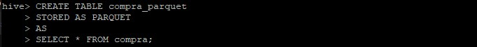

# Herramientas-para-Big-Data

Mediante esta guía vamos a emular un ambiente de trabajo para poder implementar Big Data. Vamos a utilizar herramientas como Putty,Hadoop,Hive,etc.

Previamente tiene que tener instalado una máquina virtual (te recomiendo que uses VirtualBox pero puede ser cualquier máquina virtual de su agrado) y otros programas para facilitarle el aprendizaje.

# Instalación de Putty

Putty es un emulador de terminal que los usuarios de Windows pueden usar para conectarse a un sitio web. Ahora le vamos a explicar como utilizarlo para que usted pueda manejar la consola de Linux desde Windows.

En la terminal de Linux usted va a poner el comando que le paso aquí abajo para que usted pueda ver su dirección IP.
```
hostname -I
```
A usted le va a aparecer esto. Eso quiere decir que usted ya puede utilizar la terminal de Linux desde Windows con toda comodidad.


Una vez instalado Putty vamos a proceder a seguir con la guía.

Lo que vamos a hacer ahora es clonar nuestro repositorio e inicializar nuestro docker-compose
```
https://github.com/LautaroVergaraAmodeo97/Herramientas-para-Big-Data.git
cd herramientas_big_data
sudo docker-compose -f docker-compose-vX.yml up -d
```

# Entorno Docker con Hadoop,Spark y Hive

En este espacio vamos a mostrarle a usted como implementar Hadoop,Hive,HBase,MongoDB,Neo4J;Zeppelin y Kafka. Espero que le sea útil esta guía.

# 1) HDFS

En este caso vamos a utilizar el archivo docker-compose-v1.yml para este ejercicio.

Este comando ejecuta un shell bash dentro del contenedor Docker llamado namenode. La opción -it se utiliza para iniciar una sesión interactiva y asignar un pseudo terminal al contenedor. Esto permite interactuar con el shell dentro del contenedor.
```
  sudo docker exec -it namenode bash
```
Una vez dentro del contenedor, este comando cambia el directorio de trabajo actual a /home.
```
  cd home
```
 Este comando crea un nuevo directorio llamado Datasets dentro del directorio /home.
```
  mkdir Datasets
```
Este comando sale del shell dentro del contenedor Docker. Una vez ejecutado, volverás al shell de tu sistema operativo principal.
```
  exit
```
Este comando copia un archivo desde tu sistema operativo principal (especificado por <path><archivo>) al contenedor Docker llamado namenode, dentro del directorio /home/Datasets/ del contenedor. 
```
  sudo docker cp <path><archivo> namenode:/home/Datasets/<archivo>
```
Este sería el resultado que tienes que obtener


# 2) Hive

En este caso vamos a utilizar el archivo docker-compose-v2.yml


Luego ejecutamos esto
```
  sudo docker exec -it hive-server bash
```
sudo docker exec -it hive-server bash: Este comando ejecuta un contenedor de Docker con nombre hive-server y abre una sesión interactiva en el contenedor con el intérprete de comandos bash. Aquí está lo que hace cada parte del comando:
	sudo: Es un comando que se usa para ejecutar otros comandos con privilegios de superusuario.
	docker exec: Es un comando de Docker que se utiliza para ejecutar un comando dentro de un contenedor en ejecución.
	-it: Es una opción que indica a Docker que abra la sesión de forma interactiva (Interactive Mode) y que se asocie con la entrada y salida estándar del terminal.
	hive-server: Es el nombre del contenedor de Docker que se va a ejecutar.
	bash: Es el comando que se ejecutará dentro del contenedor. En este caso, se abrirá una sesión de bash dentro del contenedor.

```
  hive
```
hive: Después de ejecutar el comando anterior y abrir una sesión en el contenedor, ahora estás dentro del contenedor de Docker. Una vez allí, puedes ejecutar el comando hive, que es el cliente de línea de comandos de Hive. Este comando te permite interactuar con Hive y ejecutar consultas SQL sobre los datos almacenados en Hadoop Distributed File System (HDFS) utilizando el lenguaje HiveQL.
Anexo: Para poder ejecutar un script de Hive se requiere este comando. Además le ofrezco este pdf por si a usted le sigue interesando la sintaxis de Hive.

El resultado debería ser este.


Y para finalizar usted puede ejecutar la sintaxis de Hive dentro de la terminal.


O para hacerlo más simple usted puede escribir esta sintaxis en su terminal y que se ejecute perfectamente.
```
hive -f <script.hql>
```


# 3) Formato de Almacenamiento 
Las tablas creadas en el punto 2 a partir de archivos en formato csv, deben ser almacenadas en formato Parquet + Snappy. Tener en cuenta además de aplicar particiones para alguna de las tablas.

Acceder al contenedor de Hive Server: Utiliza el comando sudo docker exec -it hive-server bash en Putty para acceder al contenedor de Hive Server.
```
  sudo docker exec -it hive-server bash
```

Iniciar la CLI de Hive: Una vez dentro del contenedor, ejecuta el comando hive para iniciar la interfaz de línea de comandos de Hive.
```
  hive
```

Cambiar el formato de almacenamiento a Parquet: Utiliza el comando CREATE TABLE ... STORED AS PARQUET para crear nuevas tablas con el formato de almacenamiento Parquet.



Aplicar compresión Snappy: Utiliza el comando ALTER TABLE ... SET TBLPROPERTIES para configurar la compresión Snappy en la tabla recién creada. Por ejemplo:


Crear tablas particionadas: Utiliza el comando CREATE TABLE ... PARTITIONED BY para crear tablas particionadas.


# 4) SQL
La mejora en la velocidad de consulta que puede proporcionar un índice tiene el costo del procesamiento adicional para crear el índice y el espacio en disco para almacenar las referencias del índice. Se recomienda que los índices se basen en las columnas que utiliza en las condiciones de filtrado. El índice en la tabla puede degradar su rendimiento en caso de que no los esté utilizando. Crear índices en alguna de las tablas cargadas y probar los resultados:

Ejemplo:
```
hive> CREATE INDEX index_students ON TABLE students(id) 
 > AS 'org.apache.hadoop.hive.ql.index.compact.CompactIndexHandler' 
 > WITH DEFERRED REBUILD ;
```


# 5) No-SQL

Retomando un poco el rumbo a Big Data, nosotros utilizamos No-Sql porque están optimizadas para operaciones de lectura y escritura rápidas y pueden proporcionar un alto rendimiento para cargas de trabajo intensivas.

En este caso vamos a utilizar HBase. Más adelante vamos a demostrarle como usar MongoDB,Neo4J y Zepellin para realizar esta guía a la perfección.

En este caso vamos a utilizar el archivo docker-compose-v3.yml para estos ejercicios.

- HBase:
```
	1- sudo docker exec -it hbase-master hbase shell
```
sudo: Es un comando que se utiliza en sistemas Unix y Linux para ejecutar otros comandos con privilegios de superusuario.
docker exec: Es un comando de Docker que se utiliza para ejecutar un comando dentro de un contenedor en ejecución.
-it: Son opciones de línea de comandos que se utilizan con docker exec para indicar que se desea interactuar con el contenedor de manera interactiva y asignar un terminal.
hbase-master: Es el nombre o el identificador del contenedor de Docker que deseas ejecutar. En este caso, se está indicando que se desea ejecutar el comando dentro del 	contenedor llamado "hbase-master".
hbase shell: Es el comando que se ejecutará dentro del contenedor de Docker. hbase shell se utiliza para iniciar una interfaz de línea de comandos interactiva para interactuar 
 con HBase. Desde esta interfaz, puedes ejecutar comandos de HBase para administrar bases de datos, tablas, etc.
```
		create 'personal','personal_data'
		list 'personal'
		put 'personal',1,'personal_data:name','Juan'
		put 'personal',1,'personal_data:city','Córdoba'
		put 'personal',1,'personal_data:age','25'
		put 'personal',2,'personal_data:name','Franco'
		put 'personal',2,'personal_data:city','Lima'
		put 'personal',2,'personal_data:age','32'
		put 'personal',3,'personal_data:name','Ivan'
		put 'personal',3,'personal_data:age','34'
		put 'personal',4,'personal_data:name','Eliecer'
		put 'personal',4,'personal_data:city','Caracas'
		get 'personal','4'
```
```	2-En el namenode del cluster:

		hdfs dfs -put personal.csv /hbase/data/personal.csv
```
hdfs: Es el comando principal para interactuar con el sistema de archivos distribuido de Hadoop (Hadoop Distributed File System, HDFS).
dfs: Es un subcomando de hdfs que se utiliza para realizar operaciones relacionadas con el sistema de archivos distribuido.
-put: Es una opción del subcomando dfs que se utiliza para copiar archivos o directorios desde el sistema de archivos local a HDFS.
personal.csv: Es el nombre del archivo local que se copiará a HDFS.
/hbase/data/personal.csv: Es la ruta en HDFS donde se copiará el archivo personal.csv.


```	3-sudo docker exec -it hbase-master bash
		
    hbase org.apache.hadoop.hbase.mapreduce.ImportTsv -Dimporttsv.separator=',' -Dimporttsv.columns=HBASE_ROW_KEY,personal_data:name,personal_data:city,personal_data:age personal hdfs://namenode:9000/hbase/data/personal.csv
		hbase shell
		scan 'personal'
		create 'album','label','image'
		put 'album','label1','label:size','10'
		put 'album','label1','label:color','255:255:255'
		put 'album','label1','label:text','Family album'
		put 'album','label1','image:name','holiday'
		put 'album','label1','image:source','/tmp/pic1.jpg'
		get 'album','label1'
```
sudo: Es un comando utilizado en sistemas basados en Unix/Linux para ejecutar otro comando con privilegios de superusuario (root).
docker exec: Es el comando de Docker utilizado para ejecutar un comando dentro de un contenedor en ejecución.
-it: Son opciones que se utilizan junto con docker exec para indicar que se desea abrir una sesión interactiva en el contenedor y conectarla al terminal actual.
hbase-master: Es el nombre del contenedor Docker en el que se desea ejecutar el comando.
bash: Es el comando que se ejecutará dentro del contenedor. En este caso, se ejecutará el shell Bash, lo que permite interactuar con el sistema operativo del contenedor de manera interactiva.


- MongoDB:
```
	1) 	sudo docker cp iris.csv mongodb:/data/iris.csv
		  sudo docker cp iris.json mongodb:/data/iris.json
```
sudo: es un comando que se utiliza en sistemas basados en Unix/Linux para ejecutar otro comando con privilegios de superusuario (root).
docker cp: es un comando de Docker que se utiliza para copiar archivos o directorios entre el sistema de archivos del host y un contenedor de Docker.
iris.csv: es el nombre del archivo que se va a copiar desde el sistema de archivos del host.
mongodb:/data/iris.csv: especifica la ruta de destino dentro del contenedor de Docker donde se copiará el archivo. En este caso, mongodb es el nombre del contenedor y /data/iris.csv es la ruta en la que se colocará el archivo dentro del contenedor.

```
	2)  sudo docker exec -it mongodb bash
```
sudo: es un comando que se utiliza en sistemas basados en Unix/Linux para ejecutar otro comando con privilegios de superusuario (root).
docker exec: es un comando de Docker que se utiliza para ejecutar un comando dentro de un contenedor en ejecución.
-it: son opciones que se utilizan con el comando docker exec para abrir una sesión interactiva en el contenedor.
mongodb: es el nombre del contenedor en el que se ejecutará el comando.
bash: es el comando que se ejecutará dentro del contenedor. En este caso, abrirá un intérprete de comandos Bash en el contenedor.
```
	3) 	mongoimport /data/iris.csv --type csv --headerline -d dataprueba -c iris_csv
		  mongoimport --db dataprueba --collection iris_json --file /data/iris.json --jsonArray
```
mongoimport: es el comando que se utiliza para importar datos a MongoDB desde un archivo.
/data/iris.csv: es la ruta del archivo CSV que se importará a MongoDB.
--type csv: especifica el tipo de archivo que se está importando, en este caso, CSV.
--headerline: indica que la primera línea del archivo CSV contiene los nombres de las columnas.
-d dataprueba: especifica la base de datos de MongoDB a la que se importarán los datos. En este caso, la base de datos se llama "dataprueba".
-c iris_csv: especifica la colección de MongoDB en la que se importarán los datos. En este caso, la colección se llama "iris_csv".

```
	4) mongosh
		use dataprueba
		show collections
		db.iris_csv.find()
		db.iris_json.find()
```

 ```
	5) 	mongoexport --db dataprueba --collection iris_csv --fields sepal_length,sepal_width,petal_length,petal_width,species --type=csv --out /data/iris_export.csv
		mongoexport --db dataprueba --collection iris_json --fields sepal_length,sepal_width,petal_length,petal_width,species --type=json --out /data/iris_export.json

```
mongoexport: es el comando que se utiliza para exportar datos desde MongoDB.
--db dataprueba: especifica la base de datos de MongoDB de la que se exportarán los datos. En este caso, la base de datos se llama "dataprueba".
--collection iris_csv: especifica la colección de MongoDB de la que se exportarán los datos. En este caso, la colección se llama "iris_csv".
--fields sepal_length,sepal_width,petal_length,petal_width,species: especifica los campos que se exportarán del documento. En este caso, se exportarán los campos sepal_length, sepal_width, petal_length, petal_width y species.
--type=csv: especifica el tipo de archivo de salida, que en este caso es CSV.
--out /data/iris_export.csv: especifica la ubicación y el nombre del archivo CSV de salida. En este caso, el archivo CSV se guardará en /data/iris_export.csv
```

	6) 	Descargar desde https://search.maven.org/search?q=g:org.mongodb.mongo-hadoop los jar:
		https://search.maven.org/search?q=a:mongo-hadoop-hive
		https://search.maven.org/search?q=a:mongo-hadoop-spark
		
		sudo docker cp mongo-hadoop-hive-2.0.2.jar hive-server:/opt/hive/lib/mongo-hadoop-hive-2.0.2.jar
		sudo docker cp mongo-hadoop-core-2.0.2.jar hive-server:/opt/hive/lib/mongo-hadoop-core-2.0.2.jar
		sudo docker cp mongo-hadoop-spark-2.0.2.jar hive-server:/opt/hive/lib/mongo-hadoop-spark-2.0.2.jar
		sudo docker cp mongo-java-driver-3.12.11.jar hive-server:/opt/hive/lib/mongo-java-driver-3.12.11.jar
		
	7) 	sudo docker cp iris.hql hive-server:/opt/iris.hql
		sudo docker exec -it hive-server bash

	8) 	hiveserver2
		chmod 777 iris.hql
		hive -f iris.hql
```
-  Neo4J
```
		CREATE (a:Location {name: 'A'}),
			   (b:Location {name: 'B'}),
			   (c:Location {name: 'C'}),
			   (d:Location {name: 'D'}),
			   (e:Location {name: 'E'}),
			   (f:Location {name: 'F'}),
			   (a)-[:ROAD {cost: 50}]->(b),
			   (b)-[:ROAD {cost: 50}]->(a),
			   (a)-[:ROAD {cost: 50}]->(c),
			   (c)-[:ROAD {cost: 50}]->(a),
			   (a)-[:ROAD {cost: 100}]->(d),
			   (d)-[:ROAD {cost: 100}]->(a),
			   (b)-[:ROAD {cost: 40}]->(d),
			   (d)-[:ROAD {cost: 40}]->(b),
			   (c)-[:ROAD {cost: 40}]->(d),
			   (d)-[:ROAD {cost: 40}]->(c),
			   (c)-[:ROAD {cost: 80}]->(e),
			   (e)-[:ROAD {cost: 80}]->(c),
			   (d)-[:ROAD {cost: 30}]->(e),
			   (e)-[:ROAD {cost: 30}]->(d),
			   (d)-[:ROAD {cost: 80}]->(f),
			   (f)-[:ROAD {cost: 80}]->(d),
			   (e)-[:ROAD {cost: 40}]->(f),
			   (f)-[:ROAD {cost: 40}]->(e);
			   
		CALL gds.graph.project(
			'miGrafo',
			'Location',
			'ROAD',
			{
				relationshipProperties: 'cost'
			}
		)

		MATCH (l:Location) RETURN l
					
		MATCH (source:Location {name: 'A'}), (target:Location {name: 'E'})
		CALL gds.shortestPath.dijkstra.write.estimate('miGrafo', {
			sourceNode: source,
			targetNode: target,
			relationshipWeightProperty: 'cost',
			writeRelationshipType: 'PATH'
		})
		YIELD nodeCount, relationshipCount, bytesMin, bytesMax, requiredMemory
		RETURN nodeCount, relationshipCount, bytesMin, bytesMax, requiredMemory

		MATCH (source:Location {name: 'A'}), (target:Location {name: 'E'})
		CALL gds.shortestPath.dijkstra.stream('miGrafo', {
			sourceNode: source,
			targetNode: target,
			relationshipWeightProperty: 'cost'
		})
		YIELD index, sourceNode, targetNode, totalCost, nodeIds, costs, path
		RETURN
			index,
			gds.util.asNode(sourceNode).name AS sourceNodeName,
			gds.util.asNode(targetNode).name AS targetNodeName,
			totalCost,
			[nodeId IN nodeIds | gds.util.asNode(nodeId).name] AS nodeNames,
			costs,
			nodes(path) as path
		ORDER BY index
```

# 6) Spark
Se pueden utilizar los entornos docker-compose-v4.yml y docker-compose-kafka.yml

Spark y Scala:
Ubicarse en la línea de comandos del Spark master y comenzar PySpark.
```
  docker exec -it spark-master bash
  /spark/bin/pyspark --master spark://spark-master:7077

```

docker exec -it spark-master bash: ejecuta un comando dentro del contenedor de Docker llamado spark-master y abre una terminal interactiva (bash) en ese contenedor.
/spark/bin/pyspark: una vez dentro del contenedor, ejecuta el comando pyspark, que inicia una sesión interactiva de PySpark. PySpark es la API de Python para Apache Spark, que permite interactuar con Spark utilizando Python.
--master spark://spark-master:7077: especifica el nodo maestro de Spark al que se conectará PySpark. En este caso, se conectará al nodo maestro con la dirección spark-master y el puerto 7077. Esto permite que PySpark se comunique con el clúster de Spark y distribuya las tareas de procesamiento de manera adecuada.

Cargar raw-flight-data.csv desde HDFS.

```
	from pyspark.sql.types import *

	flightSchema = StructType([
	StructField("DayofMonth", IntegerType(), False),
	StructField("DayOfWeek", IntegerType(), False),
	StructField("Carrier", StringType(), False),
	StructField("OriginAirportID", IntegerType(), False),
	StructField("DestAirportID", IntegerType(), False),
	StructField("DepDelay", IntegerType(), False),
	StructField("ArrDelay", IntegerType(), False),
	]);

	flights = spark.read.csv('hdfs://namenode:9000/data/flights/raw-flight-data.csv', schema=flightSchema, header=True)
  
  	flights.show()
	  +----------+---------+-------+---------------+-------------+--------+--------+
|DayofMonth|DayOfWeek|Carrier|OriginAirportID|DestAirportID|DepDelay|ArrDelay|
+----------+---------+-------+---------------+-------------+--------+--------+
|        19|        5|     DL|          11433|        13303|      -3|       1|
|        19|        5|     DL|          14869|        12478|       0|      -8|
|        19|        5|     DL|          14057|        14869|      -4|     -15|
|        19|        5|     DL|          15016|        11433|      28|      24|
|        19|        5|     DL|          11193|        12892|      -6|     -11|
|        19|        5|     DL|          10397|        15016|      -1|     -19|
|        19|        5|     DL|          15016|        10397|       0|      -1|
|        19|        5|     DL|          10397|        14869|      15|      24|
|        19|        5|     DL|          10397|        10423|      33|      34|
|        19|        5|     DL|          11278|        10397|     323|     322|
|        19|        5|     DL|          14107|        13487|      -7|     -13|
|        19|        5|     DL|          11433|        11298|      22|      41|
|        19|        5|     DL|          11298|        11433|      40|      20|
|        19|        5|     DL|          11433|        12892|      -2|      -7|
|        19|        5|     DL|          10397|        12451|      71|      75|
|        19|        5|     DL|          12451|        10397|      75|      57|
|        19|        5|     DL|          12953|        10397|      -1|      10|
|        19|        5|     DL|          11433|        12953|      -3|     -10|
|        19|        5|     DL|          10397|        14771|      31|      38|
|        19|        5|     DL|          13204|        10397|       8|      25|
+----------+---------+-------+---------------+-------------+--------+--------+
only showing top 20 rows
  	flights.describe()
```

Ubicarse en la línea de comandos del Spark master y comenzar Scala.

```
  docker exec -it spark-master bash
  spark/bin/spark-shell --master spark://spark-master:7077
```

docker exec -it spark-master bash: ejecuta un comando dentro del contenedor de Docker llamado spark-master y abre una terminal interactiva (bash) en ese contenedor.
spark/bin/spark-shell: una vez dentro del contenedor, ejecuta el comando spark-shell, que inicia una sesión interactiva de Spark. spark-shell es la interfaz de línea de comandos de Spark para Scala, que permite interactuar con Spark utilizando el lenguaje de programación Scala.
--master spark://spark-master:7077: especifica el nodo maestro de Spark al que se conectará Spark. En este caso, se conectará al nodo maestro con la dirección spark-master y el puerto 7077. Esto permite que Spark se comunique con el clúster de Spark y distribuya las tareas de procesamiento de manera adecuada.


Kafka
```
			sudo docker-compose up -d
			sudo docker exec -it kafka_container bash
			cd /opt/kafka/bin
			sh kafka-topics.sh --create --bootstrap-server kafka:9092 --replication-factor 1 --partitions 100 --topic demo
			sh kafka-topics.sh --list --bootstrap-server kafka:9092
			sh kafka-topics.sh --describe --bootstrap-server kafka:9092 --topic demo 
			sh kafka-console-consumer.sh --bootstrap-server kafka:9092 --topic demo --from-beginning
			sh kafka-console-producer.sh --broker-list localhost:9092 --topic demo
				Escribir desde la consola del productor "Esto es una Prueba 1" y enviar.
				
			Acceder a <IP_Anfitrion>:9000	
	
			Desde Scala:
			val df = spark.readStream
					.format("kafka")
					.option("kafka.bootstrap.servers", "192.168.1.100:9092")
					.option("subscribe", "json_topic")
					.option("startingOffsets", "earliest") // From starting
					.load()

			df.printSchema()
			
			Más ejemplos:
				https://github.com/dbusteed/kafka-spark-streaming-example
						
			Otra forma de ejecutar:
			docker-compose exec kafka kafka-console-consumer.sh --bootstrap-server kafka:9092 --topic TenMinPsgCnts --from-beginning
```
sudo docker-compose up -d: Inicia los contenedores definidos en el archivo docker-compose.yml en modo demonio (-d). Esto inicia los contenedores de Kafka, Zookeeper y otros servicios necesarios definidos en el archivo.
sudo docker exec -it kafka_container bash: Ejecuta un shell interactivo (bash) en el contenedor de Docker que ejecuta Kafka.
cd /opt/kafka/bin: Cambia al directorio que contiene los scripts de Kafka.
sh kafka-topics.sh --create --bootstrap-server kafka:9092 --replication-factor 1 --partitions 100 --topic demo: Crea un nuevo tema llamado "demo" con un factor de replicación de 1, 100 particiones y usando el servidor de arranque (bootstrap server) en kafka:9092.
sh kafka-topics.sh --list --bootstrap-server kafka:9092: Lista todos los temas presentes en el clúster Kafka usando el servidor de arranque en kafka:9092.
sh kafka-topics.sh --describe --bootstrap-server kafka:9092 --topic demo: Proporciona detalles sobre el tema "demo", como el número de particiones y los líderes de particiones, utilizando el servidor de arranque en kafka:9092.
sh kafka-console-consumer.sh --bootstrap-server kafka:9092 --topic demo --from-beginning: Inicia un consumidor de Kafka que lee mensajes del principio del tema "demo" utilizando el servidor de arranque en kafka:9092.
sh kafka-console-producer.sh --broker-list localhost:9092 --topic demo: Inicia un productor de Kafka que envía mensajes al tema "demo" utilizando el corredor en localhost:9092.


Y con esto finalizamos toda esta guía. Espero que le haya sido útil.


-------------------------------------------Aclaración----------------------------------------------------------------------


Insertar error en la consola
